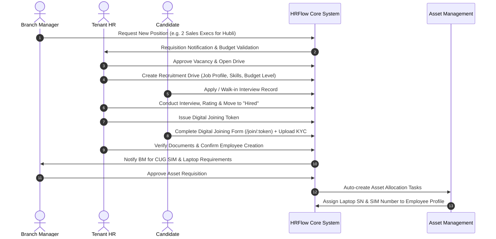
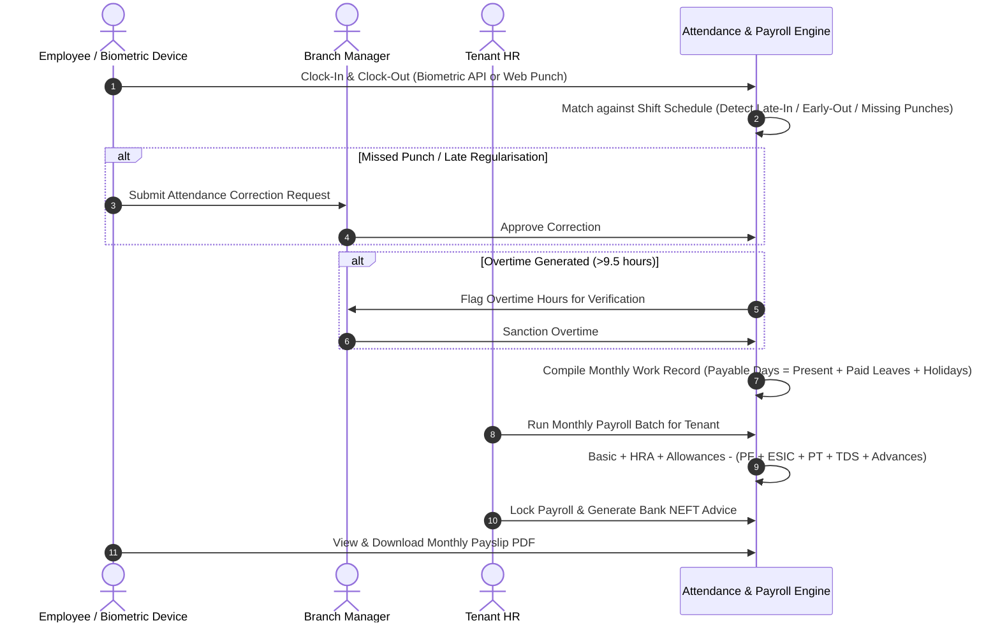
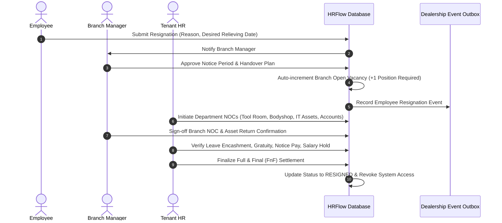

# Comprehensive Reference Study: Horilla HRMS Architecture & HRFlow Dealership Adaptation

## Executive Summary

This reference study analyzes **Horilla HRMS** (Open-Source LGPL-3.0 Human Resource Management System) and establishes a precise gap analysis and architectural roadmap for upgrading **HRFlow**—the multi-tenant HRMS engineered for automobile dealership groups (with **Bellad Group** as the reference tenant).

---

## 1. Verified Horilla Modules & Submodules Catalog

Based on inspection of Horilla documentation (`docs.horilla.com`), official GitHub repositories (`horilla/horilla-hr`), and functional schemas, Horilla is structured around 11 distinct functional domains:

```text
Horilla HRMS Architecture
├── 1. Employee Management
│   ├── Profile & Digital Dossier (12 Sub-Tabs)
│   ├── Document Request & Verification
│   ├── Shift & Work-Type Request
│   ├── Rotating Shift / Work-Type Assignment
│   ├── Shift Reallocation (Peer-to-Peer with Approval)
│   ├── Disciplinary Actions & Warnings
│   ├── Company Policies & Broadcasts
│   └── Interactive Organization Chart
│
├── 2. Recruitment & Applicant Tracking (ATS)
│   ├── Recruitment Drives & Pipeline Management
│   ├── Multi-Stage Pipeline (Initial, Interview, Hired, Cancelled)
│   ├── Kanban & Tabular Stage Views
│   ├── Resume Screening & Keyword Shortlisting
│   ├── Candidate Evaluation & Star Ratings (1–5)
│   ├── Interview Scheduling & Interviewer Allocation
│   ├── Survey & Application Question Templates
│   └── Candidate Self-Tracking Portal
│
├── 3. Employee Onboarding
│   ├── Candidate-to-Employee Transition
│   ├── Multi-Stage Onboarding Checklists
│   ├── Digital Joining Portal Link Generation
│   ├── Self-Service Profile & Bank Account Creation
│   └── Welcome & Dashboard Handover
│
├── 4. Attendance & Time Tracking
│   ├── Clock-In / Clock-Out Punch Capture
│   ├── Three-Tier Attendance Processing (Validate, Overtime, Validated)
│   ├── Shift Schedules, Late-In & Early-Out Detection
│   ├── Attendance Correction Requests & Approvals
│   ├── Hour Account (Cumulative Working Hours Ledger)
│   ├── Monthly Work Records Register (P/A/HD/L Matrix)
│   └── Biometric Hardware Integration (ZKTeco, Anviz, Dahua)
│
├── 5. Leave Management
│   ├── Configurable Leave Types (Casual, Sick, Earned, Paternity, Maternity)
│   ├── Leave Allocation Requests (Additional Quota)
│   ├── Compensatory Off (Converting Weekend/Holiday Duty)
│   ├── Team Leave Calendar & Availability View
│   ├── Multi-Level Leave Approvals
│   └── LOP (Loss of Pay) Integration with Payroll
│
├── 6. Payroll & Compensation
│   ├── Employment Contracts & Salary Structures
│   ├── Fixed & Variable Allowances (HRA, DA, Conveyance, Special)
│   ├── Deductions (Statutory, Penalties, Unpaid Leave)
│   ├── Salary Advances & Loan Amortization
│   ├── Reimbursements & Claims Processing
│   ├── Bonus Point Accrual & Cash Redemption
│   ├── Automated Monthly Payroll Generation & Approval
│   └── Payslip Generation, PDF Export & Bank Payment Advice
│
├── 7. Asset Management
│   ├── Asset Master (Laptops, SIMs, Mobiles, Vehicles, Tools)
│   ├── Asset Request & Allocation Workflow
│   ├── Asset Transfer Between Employees/Branches
│   ├── Asset Return, Condition Inspection & Clearance
│   └── Asset Depreciation & Audit History
│
├── 8. Performance Management
│   ├── Goal & Objective Setting (OKRs)
│   ├── Performance Review Cycles
│   ├── 360-Degree Feedback & Questionnaires
│   ├── Self-Assessments & Manager Appraisals
│   └── Appraisal History & Merit Rating
│
├── 9. Helpdesk & HR Ticketing
│   ├── Employee Service Requests & Complaints
│   ├── Priority Matrix (Low, Medium, High, Urgent)
│   ├── Ticket Category Routing & HR Assignee Allocation
│   ├── Internal Comments, Attachments & Audit Log
│   └── Resolution SLA Tracking & Closure
│
├── 10. Offboarding & Exit Management
│   ├── Resignation Submission & Notice Period Calculation
│   ├── Manager Review & HR Clearance
│   ├── Multi-Department No-Objection Certificates (NOC)
│   ├── Company Asset Handover & Verification
│   ├── Full & Final (F&F) Settlement Calculation
│   └── Employee Status Revocation & Exit Interview
│
└── 11. System Administration & Settings
    ├── Organization Structure (Branches, Departments, Job Roles)
    ├── Multi-Level Approval Process Configurations
    ├── Email & In-App Notification Templates
    ├── Role-Based Access Control (RBAC) & Group Permissions
    └── Audit Logs & Data Import/Export (CSV/Excel)
```

---

## 2. Important Pages, Roles & Purpose Matrix

| Module | Route / Page | Primary Roles | Purpose & Key Workflows |
|---|---|---|---|
| **Dashboard** | `/dashboard` | All (Role-Adaptive) | KPI widgets, attendance punches, pending approvals, manpower count, quick actions. |
| **Employee** | `/employees` | HR, BM | Filterable list view of all staff with branch, designation, status, level filters. |
| **Employee Profile** | `/employees/:id` | All | 12-tab comprehensive profile: Personal, Work, Statutory, Shift, Attendance, Leave, Payroll, Assets, Documents, Bonus, Resignation. |
| **Org Chart** | `/employees/org-chart` | HR, BM, Employee | Interactive hierarchical tree showing reporting lines and department nodes. |
| **Doc Requests** | `/employees/document-requests` | HR, Employee | Formal admin request for specific KYC/credentials; employee file upload; approval stamping. |
| **Shift Requests** | `/employees/shift-requests` | Employee, BM, HR | Roster shift assignment, rotating shift cycles, peer shift reallocation requests. |
| **Recruitment** | `/recruitment` | HR, BM | Drive management, multi-candidate Kanban board, stage transitions, star rating. |
| **Vacancies** | `/vacancies` | HR, BM | Manpower budgets vs actuals, requisition form for BM, position freeze/hold. |
| **Onboarding** | `/joining` | HR, BM | Public candidate self-onboarding portal, verification checklists, asset approval triggers. |
| **Attendance** | `/attendance` | All | Biometric punch logs, check-in/out, anomaly validation tab, overtime approval, monthly register. |
| **Attendance Req** | `/attendance/corrections` | Employee, BM, HR | Regularisation requests for missed punches; BM verification and HR sanction. |
| **Leave** | `/leave` | All | Leave application, leave ledger, team leave calendar, compensatory off requests. |
| **Payroll** | `/payroll` | HR, Platform Admin | Monthly batch processing, gross-to-net calculations, statutory deductions (PF, ESI, PT, TDS). |
| **Payslips** | `/payroll/payslips` | Employee, HR | Individual printable/downloadable monthly salary slips with earnings & deductions breakdown. |
| **Salary Advances** | `/advances` | All | Advance request, BM review, HR clearance, automated monthly EMI deduction. |
| **Assets** | `/assets` | HR, BM, Employee | Asset inventory, allocation requests, approval, serial number assignment, return clearance. |
| **Claims & Expenses** | `/claims` | All | Level-based travel, daily allowance, hotel accommodation claims with bill attachments. |
| **Helpdesk** | `/helpdesk` | All | HR query ticketing, category tagging, SLA tracking, resolution notes. |
| **Exit & NOC** | `/exit` | All | Resignation processing, notice period waiver, department NOC clearances, F&F calculation. |
| **Dealership Masters** | `/tenant/settings` | HR, Platform Admin | Levels 1–10 matrix, 103 designations, branch setup, statutory tax thresholds. |

---

## 3. Navigation Structure & Core User Journeys

### 3.1 Layout Architecture (Inspired by Horilla Usability)

```text
┌────────────────────────────────────────────────────────────────────────────────────────┐
│  [Logo] HRFlow   [Dealership: Bellad Group ▼]   [Branch: Hubli ▼]       [Search]  🔔  [User Profile] │
├──────────────┬─────────────────────────────────────────────────────────────────────────┤
│ ☰ Collapse   │  Breadcrumb: Dashboard > Recruitment > Hubli Showroom Drive               │
│              ├─────────────────────────────────────────────────────────────────────────┤
│ 📊 Dashboard  │  [Tab: Drives]  [Tab: Candidates]  [Tab: Pipeline]  [Tab: Interviews]     │
│ 👥 Employees  │ ┌─────────────────────────────────────────────────────────────────────┐ │
│ 💼 Vacancy   │ │ 🔍 Filter: [Designation ▼] [Branch ▼] [Stage ▼]   [+ New Candidate]   │ │
│ 🎯 Recruit   │ │                                                                     │ │
│ 📥 Onboarding │ │  ┌──────────────┐   ┌──────────────┐   ┌──────────────┐   ┌───────┐ │ │
│ ⏰ Attendance │ │  │ 1. INITIAL   │   │ 2. INTERVIEW │   │ 3. OFFERED   │   │ 4.HIRE│ │ │
│ 🏖️ Leave      │ │  ├──────────────┤   ├──────────────┤   ├──────────────┤   ├───────┤ │ │
│ 💰 Payroll    │ │  │ Suresh K.    │   │ Ramesh B.    │   │ Priya Patil  │   │ ...   │ │ │
│ 💳 Claims     │ │  │ ★★★★☆ L3     │   │ ★★★☆☆ L2     │   │ ★★★★★ L4     │   │       │ │ │
│ 💻 Assets     │ │  │ Sales Exec   │   │ Service Adv. │   │ Accounts     │   │       │ │ │
│ 🎫 Helpdesk   │ │  └──────────────┘   └──────────────┘   └──────────────┘   └───────┘ │ │
│ 🚪 Exit / F&F │ └─────────────────────────────────────────────────────────────────────┘ │
│ ⚙️ Settings   │                                                                         │
└──────────────┴─────────────────────────────────────────────────────────────────────────┘
```

### 3.2 End-to-End Dealership User Journeys

#### Journey 1: Vacancy → Recruitment → Joining → Asset Provisioning


#### Journey 2: Biometric Punch → Anomaly Validation → Overtime → Payroll


#### Journey 3: Resignation → Vacancy Update → NOC Clearances → F&F Settlement


---

## 4. UI Components Architecture & Design System

Horilla achieves exceptional usability through 6 core design patterns that HRFlow will adopt using pure **React 18 + Tailwind CSS**:

1. **HLV (Horilla List View)**:
   - Sticky table header with bulk action checkbox toolbar.
   - Granular column filtering (search inputs, multi-select dropdowns, date ranges).
   - Column sorting with visual indicator icons.
   - Density toggles (compact vs comfortable).
   - Pagination with dynamic rows-per-page (`10`, `25`, `50`, `100`).
   - Quick export to CSV/Excel and print view.

2. **HCV (Horilla Card / Kanban View)**:
   - Drag-and-drop or click-to-move card columns for pipeline workflows (Recruitment stages, Onboarding progress, Helpdesk tickets).
   - Card summaries featuring employee avatar, level badge, designation tag, rating stars, and context menu.

3. **HDV (Horilla Detailed View)**:
   - Header banner featuring employee photo, designation, level badge, employee ID, active status badge, reporting manager, and contact chips.
   - Horizontal tab navigation with badges for counts (e.g. Documents `(4)`, Assets `(2)`, Requests `(1)`).
   - Action buttons aligned to the right (Edit, Print Digital ID, Issue Warning, Transfer, Offboard).

4. **HTV (Horilla Tabbed View)**:
   - Secondary tab bar for grouping operational views within a module (e.g. Attendance: *Daily Punches* \| *Pending Corrections* \| *Overtime Approvals* \| *Monthly Register*).

5. **HFV (Horilla Form View)**:
   - Consistent responsive modal forms with backdrop blur.
   - Stepper multi-step wizards for complex flows (Employee Creation, Payroll Configuration, Exit Clearance).
   - Inline field validations, clear error messages, and loading spinners on submit.

6. **Dealership Visual Identity**:
   - Clean, professional light theme utilizing deep slate text (`text-slate-800`), indigo brand accents (`bg-indigo-600`), amber warnings, and emerald success states.
   - High-contrast typography using Google Inter font.

---

## 5. Comprehensive Gap Analysis: Horilla vs Current HRFlow

| Functional Domain | Horilla HRMS (Reference) | Existing HRFlow Status | Gap & Required Implementation for HRFlow | Priority |
|---|---|---|---|---|
| **Multi-Tenancy** | Single company / basic multi-company | Fully multi-tenant with Tenant, Firm, Brand, Branch, Department | **Keep & Enhance**: Already exceeds Horilla with 6-tier dealership model. | Critical |
| **Employee Hierarchy** | Generic roles and titles | Bellad Levels 1–10 + 103 Dealership Designations | **Keep & Enhance**: Level-based statutory rules & reporting structures. | Critical |
| **Employee Profile** | 12 interactive sub-tabs with personal, shift, attendance, leave, docs | Basic 5 tabs (Personal, Work, Statutory, Docs, Transfers) | **Add**: Shift tab, Leave balances tab, Penalty account, Bonus points, Digital ID card modal. | High |
| **Org Chart** | Interactive hierarchical tree chart | None (Flat listing only) | **Add**: Visual interactive organization chart rendered by branch and department. | Medium |
| **Document Requests** | Admin requests document, employee uploads, admin approves/rejects | Basic document upload during joining | **Add**: Document requisition workflow with audit tracking and expiry alerts. | High |
| **Recruitment (ATS)** | Full pipeline with stages, resume screening, candidate rating, interviews | Vacancy master & joining form only | **Add**: Recruitment drives, interview scheduler, candidate rating stars, pipeline Kanban. | High |
| **Vacancy Master** | Job position vacancy counter | Basic Manpower Budget & Position models | **Enhance**: Branch Manager requisition flow, hold/freeze controls, auto-update on exit. | High |
| **Onboarding** | Multi-stage checklists, portal link, bank details, welcome screen | Token-based `/join/:token` form exists | **Enhance**: Post-joining CUG SIM and laptop asset approval chaining. | Medium |
| **Attendance** | Check-in/out, biometric sync, anomaly validate, overtime, work records | Basic check-in/out, hours calculation, correction request | **Enhance**: Biometric device abstraction layer API, 3-tier validation tabs, monthly register grid. | High |
| **Leave Management** | Comprehensive leave types, allocation requests, comp-off, leave calendar | Primitive `ON_LEAVE` status in attendance table | **Add**: Complete Leave Module (Leave types, balances, applications, approvals, calendar, comp-off). | Critical |
| **Indian Payroll** | General contract-based salary slips, loans, encashment | Dedicated Indian payroll (PF, ESI, PT, TDS, advances, advice) | **Enhance**: Add salary hold management, F&F settlement calculator, contract effective-dating. | High |
| **Claims & Expenses** | General reimbursement requests | None | **Add Dealership Module**: Level 1–10 travel, food, lodging eligibility matrix with city tiers. | Critical |
| **Asset Management** | Full asset inventory, requests, allocations, returns | Primitive `EmployeeAsset` table with SIM/Laptop | **Enhance**: Central asset master (serials, status, return inspections, allocation history). | High |
| **Performance** | Goals, OKRs, 360-degree feedback, appraisal questionnaires | None | **Add**: Performance review cycles, KPI checklists, manager appraisals. | Medium |
| **Helpdesk** | HR ticketing system with priorities and resolution notes | None | **Add**: Employee HR query ticketing, ticket routing, status tracking. | Medium |
| **Offboarding** | Resignation requests, notice periods, exit interviews | Resignation & NOC approvals in place | **Enhance**: Multi-department NOC checklist, asset return inspection, F&F finalization. | High |

---

## 6. Features Not Verifiable Without Demo / Hardware Access

To ensure strict engineering integrity, the following features described in marketing/docs are noted as requiring external hardware or production infrastructure:

1. **Biometric Hardware Firmware APIs**: Real-time socket connections to physical ZKTeco/Anviz hardware depend on local network presence and device firmware; HRFlow will implement a clean, standard RESTful biometric sync interface (`POST /api/v1/integrations/biometric/punch`) accepting standard device payloads.
2. **Third-Party WhatsApp Notification Webhooks**: Commercial WhatsApp Business API credentials required for live dispatch; HRFlow will implement notification dispatcher abstractions.
3. **LDAP / Active Directory Sync**: Enterprise AD integration requires an active LDAP directory; simulated via Keycloak OIDC user sync.

---

## 7. Prioritized Implementation Roadmap

```text
PHASE 1: Reference Study & Architectural Foundation (COMPLETED)
└── Comprehensive Horilla inspection, documentation & gap analysis matrix.

PHASE 2: Shared UI, Topbar/Collapsible Sidebar & Role Dashboards
├── Collapsible Sidebar with module grouping and badge counts
├── Global Header with Dealership Tenant Switcher, Branch Switcher & Quick Punch
└── Role-Adaptive Dashboards for Platform Admin, Tenant HR, Branch Manager, and Employee.

PHASE 3: Employee Master 2.0 & Organization Structure
├── 12-Tab Profile View (About, Work/Shift, Attendance, Leave, Payroll, Assets, Documents, ID)
├── Interactive Organization Chart View
└── Document Requisition & Verification Workflow.

PHASE 4: Recruitment Pipeline, Vacancy Master & Digital Onboarding
├── Multi-Stage Recruitment Pipeline (Kanban & Tabular views with Star Ratings)
├── Interview Scheduling & Candidate Notes
├── Branch Manager Vacancy Requisition & Auto-Adjustment on Resignation
└── Post-Joining CUG SIM and Laptop Approval Chaining.

PHASE 5: Attendance 2.0, Biometric Abstraction Layer & Leave Management
├── 3-Tier Attendance Processing (Validate Attendance, Overtime Approval, Validated)
├── Biometric Integration REST Gateway for Dealership Clocks
├── Complete Leave Management Engine (Leave types, quotas, applications, approvals)
└── Compensatory Off & Monthly Attendance Register Grid.

PHASE 6: Indian Dealership Payroll 2.0 & Statutory Engine
├── Indian Payroll Engine (PF, ESI, Professional Tax, TDS slabs)
├── Effective-Dated Salary Structures & Contracts
├── Salary Advance Deductions & Bank NEFT Payment Advice
└── Full & Final (F&F) Settlement Calculator with Salary Hold.

PHASE 7: Dealership Level-Based Claims, Assets, Helpdesk & Offboarding
├── Bellad Group Level 1–10 Claims & Expenses Matrix (City Tiers, Distance, Accommodation)
├── Central Asset Inventory, Serial Tracking & Return Inspection
├── HR Helpdesk Ticketing System
└── Offboarding Multi-Department NOC Workflow & Exit Checklist.

PHASE 8: Automated Verification, Cross-Tenant Security & Ecosystem Sync
├── Comprehensive automated test suites across all new modules
├── Cross-tenant boundary validation
└── Real-time synchronization events to MAINTLY and Ecosystem Core.
```
