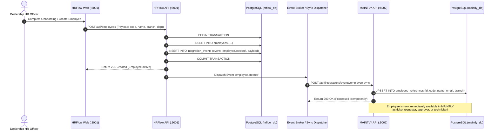

# Application Integration Architecture & Inter-App Protocols

## 1. Integration Philosophy & Ground Rules

1. **Independent Deployability**: Each application (`ecosystem-core`, `HRFlow`, `MAINTLY`, and future CRM/Billing apps) is an autonomous software artifact with its own repository/folder, dependencies, database, and CI pipeline.
2. **Zero Direct Cross-Database Writes**: No application possesses credentials or network access to write directly to another application's database. Direct cross-database SQL queries or foreign keys between databases are strictly prohibited.
3. **Canonical Central Identifiers**: All applications link to canonical identifiers issued by `ecosystem-core` (`centralTenantId`, `centralFirmId`, `centralBrandId`, `centralBranchId`, `centralUserId`).
4. **Resilient Event-Driven Synchronization**: Asynchronous state propagation relies on the **Transactional Outbox Pattern**, guaranteed at-least-once delivery, idempotent message consumption, and dead-letter queues.

---

## 2. Application Registry Model

The Application Registry in `ecosystem-core` tracks every software module available in the dealership ecosystem:

```text
┌────────────────────────────────────────────────────────┐
│                  APPLICATION REGISTRY                  │
├─────────────────┬───────────┬────────────────┬─────────┤
│ Application     │ App Key   │ Base URL       │ Status  │
├─────────────────┼───────────┼────────────────┼─────────┤
│ HRFlow HRMS     │ hrflow    │ :3001 / :5001  │ ACTIVE  │
│ MAINTLY Ops     │ maintly   │ :3002 / :5002  │ ACTIVE  │
│ Enquiry CRM     │ crm       │ :3003 / :5003  │ PLANNED │
│ Vehicle Billing │ billing   │ :3004 / :5004  │ PLANNED │
│ Spare Parts Inv │ inventory │ :3005 / :5005  │ PLANNED │
└─────────────────┴───────────┴────────────────┴─────────┘
```

Each registered application exposes:
- **Health Check**: `GET /api/health` returning `200 OK` with version and uptime.
- **Manifest / Entitlements**: List of permissions, navigation menu entries, and configuration schema.

---

## 3. HRFlow Integration Blueprint & Phase 5 Implementation

### 3.1 Preserved Operational Responsibilities
HRFlow retains 100% operational autonomy over:
- Employee Master & 10-tab digital employee dossier (`/employees`).
- Digital onboarding & joining formalities (`/joining`).
- Vacancy management & manpower budgeting (`/vacancies`).
- Biometric attendance punches, shifts & manual attendance corrections (`/attendance`).
- Leave requisitions, balances & manager approvals (`/approvals`).
- Indian payroll calculation (Gross, PF 12%, ESI 0.75%, Professional Tax, TDS holds) & Bank Payment Advices (`/payroll`).
- Organization Masters: 8-level hierarchy and 101 auto-dealership designations (`/tenant/organization-masters`).
- Immutable operational audit logs (`/audit`).

### 3.2 Additive, Non-Breaking Prisma Migrations
In Phase 5, the following additive fields were introduced to `applications/HRFlow/backend/prisma/schema.prisma` and pushed to `hrflow_db`:
- `Tenant`:
  - `centralTenantId String? @unique`
- `Branch`:
  - `centralBranchId String? @unique`
  - `centralFirmId String?`
  - `centralBrandId String?`
- `User`:
  - `centralUserId String? @unique`
- `Employee`:
  - `centralUserId String?`
  - `centralTenantId String?`
  - `centralBranchId String?`
  - `centralDepartmentId String?`

Zero existing tables, columns, or historical relationships were deleted or overwritten.

### 3.3 Canonical Identity Mapping (`mapCentralIdentities.js`)
An automated migration script was executed to cross-link local records with central ecosystem entities:
- **Dealership Tenants**:
  - `BELLAD` (Bellad Group) ➔ `883663e1-917e-4fae-8f1d-9d89e749362b`
  - `APEX-AUTO` (Apex Auto Group) ➔ `f0ea4625-4bb3-4f0a-8a67-77b53c0afb54`
- **Branches**:
  - `BELLAD-HUB` (Hubli Central HQ & Showroom) ➔ `df42516a-ac2b-4757-ae1e-fa0eddd0c246`
  - `BELLAD-BGM` (Belgaum Service & Bodyshop) ➔ `4350dbb5-8d55-405c-9456-9de567e356c4`
- **Central Users**:
  - `admin@hrflow.com` ➔ `eaf9bc24-127f-4405-8b80-ad29b5e5058e` (SuperAdmin)
  - `hr.bellad@hrflow.com` ➔ `8c1ba00f-b947-4bd7-b5b6-fe761580642f` (HR Head)
  - `bm.hubli@belladgroup.com` ➔ `6e9ca912-32b5-4b2a-b0d3-35fb1bdf32c9` (Hubli Branch Manager)
- **Employees**:
  - All 14 existing employees in `hrflow_db` were successfully backfilled with `centralTenantId` and `centralBranchId`.

### 3.4 Ecosystem Portal Application Launcher Integration
- **Target URL**: `http://localhost:3001`
- **Protocol**: Session-based Single Sign-On via Keycloak OIDC PKCE.
- **Entitlement Verification**: Ecosystem Portal queries `/api/v1/applications`. If the tenant has an active subscription to `hrflow`, the launcher renders the active application card.
- **No Token in URL**: Authentication tokens are NEVER passed through query strings. When clicking "Launch Application", the browser navigates cleanly to `http://localhost:3001`. HRFlow's `AuthContext` requests Keycloak with the user's active session cookie, receiving an immediate 302 PKCE authorization code.
- **Direct Navigation Protection**: Direct navigation to `http://localhost:3001/employees` by unauthenticated or unauthorized users is blocked by React route guards and backend HTTP 401/403 middleware.

---

## 4. MAINTLY Integration Blueprint

### Preserved Responsibilities:
- End-to-end maintenance ticketing:
  `NEW → WAITING_FOR_APPROVAL → APPROVED → ASSIGNMENT → IN_PROGRESS → PURCHASE/VENDOR → COMPLETION → SATISFACTION → CLOSED`.
- Multi-branch facility maintenance and repair tracking.
- Vendor directory, purchase orders, quotations, and spare parts costing.
- SLA breach calculations and 13 operational dashboard sections.

### Integration Points:
1. **Schema Extension (Non-Breaking)**:
   - Add `centralTenantId`, `centralFirmId`, `centralBrandId`, `centralBranchId` to org models.
   - Add `EmployeeReference` model:
     ```prisma
     model EmployeeReference {
       id             String   @id // Mirrors centralUserId or hrEmployeeId
       tenantId       String
       employeeCode   String
       firstName      String
       lastName       String
       email          String
       phone          String?
       branchId       String?
       department     String?
       designation    String?
       status         String   @default("ACTIVE")
       syncedAt       DateTime @default(now())

       @@index([tenantId])
       @@index([email])
       @@map("employee_references")
     }
     ```
   - Add `Asset` and `AssetAssignment` models to support physical equipment and asset maintenance tickets.
2. **Authentication Adapter**:
   - Update `Maintly/backend/src/middleware/auth.js` to validate Keycloak OIDC tokens.
3. **Employee Selection in Tickets**:
   - Maintenance requests can be raised by or assigned to employees using cached `EmployeeReference` records.

---

## 5. Synchronous vs. Asynchronous Communication

```
┌────────────────────────────────────────────────────────┐
│                   SYNCHRONOUS (REST)                   │
│   • Health checks & heartbeat monitoring               │
│   • On-demand token introspection                      │
│   • Live tenant subscription queries                   │
└────────────────────────────────────────────────────────┘
                           ▲
                           │
┌────────────────────────────────────────────────────────┐
│               ASYNCHRONOUS (EVENT-DRIVEN)              │
│   • employee.created / employee.updated                │
│   • employee.transferred / employee.resigned           │
│   • asset.assigned                                     │
│   • maintenance.ticket.created                         │
└────────────────────────────────────────────────────────┘
```

### Transactional Outbox Pattern
To prevent distributed transaction failures (where database write succeeds but message broker publish fails):
1. The business transaction writes domain records AND writes an `IntegrationEvent` record inside the **same local database transaction**.
2. A lightweight background worker reads pending outbox events and publishes them to RabbitMQ / Webhook dispatcher.
3. Once acknowledged, the event is marked `PUBLISHED`.
4. Consumers process the event idempotently using `eventId`.

---

## 6. The First Cross-Application Workflow: HR-to-Maintenance Employee Synchronization



---

## 7. Phase 6 Implementation: MAINTLY Central Ecosystem & Employee Integration Models

### 7.1 Implemented `EmployeeReference` Model (`applications/Maintly/backend/prisma/schema.prisma`)
MAINTLY's PostgreSQL database (`maintly_db`) preserves autonomy while storing cached references to central dealership employees:

```prisma
model EmployeeReference {
  id              String    @id @default(uuid())
  tenantId        String
  centralTenantId String
  hrEmployeeId    String?
  centralUserId   String?
  centralBranchId String?
  employeeCode    String
  firstName       String
  lastName        String
  email           String
  phone           String?
  branchId        String?
  department      String?
  designation     String?
  status          String    @default("ACTIVE")
  syncedAt        DateTime  @default(now())
  createdAt       DateTime  @default(now())
  updatedAt       DateTime  @updatedAt

  tenant Tenant  @relation(fields: [tenantId], references: [id], onDelete: Cascade)
  branch Branch? @relation(fields: [branchId], references: [id], onDelete: SetNull)

  @@index([tenantId])
  @@index([centralTenantId])
  @@index([hrEmployeeId])
  @@index([centralUserId])
  @@index([email])
  @@map("employee_references")
}
```

### 7.2 Service-to-Service (S2S) Authentication Preparation
- **Issuer & Audience**: Keycloak issues S2S service tokens with audience `['hrflow-api', 'maintly-api', 'ecosystem-core-api']`.
- **Client Credentials Flow**: Service account clients (`maintly-service-account` / `hrflow-service-account`) configured in Keycloak realm.
- **REST Sync Endpoint**: HRFlow exposes `GET /api/v1/integrations/employees` returning sanitized, authorized employee records.
- **Scope Restriction**: No automatic background synchronization worker was triggered in Phase 6; full real-time event streaming and outbox workers are implemented in Phase 7.

---

## 8. Phase 7 Implementation: Reliable HRFlow to MAINTLY Employee Synchronization

### 8.1 Transactional Outbox Pattern in HRFlow
To guarantee at-least-once delivery without distributed transactions, HRFlow implements the Transactional Outbox Pattern (`hrflow_db`):

```prisma
model OutboxEvent {
  id              String    @id @default(uuid())
  tenantId        String
  centralTenantId String?
  eventType       String
  aggregateType   String    @default("EMPLOYEE")
  aggregateId     String
  payload         Json
  status          String    @default("PENDING") // PENDING, PUBLISHING, PUBLISHED, FAILED
  retryCount      Int       @default(0)
  errorMessage    String?
  nextRetryAt     DateTime  @default(now())
  publishedAt     DateTime?
  createdAt       DateTime  @default(now())
  updatedAt       DateTime  @updatedAt

  @@index([status, nextRetryAt])
  @@index([tenantId])
  @@index([eventType])
  @@map("outbox_events")
}
```

- **Atomic Transactions**: In `employeeController.js` and `automationService.js`, every mutation (`createEmployee`, `updateEmployee`, `transferEmployee`, `deactivateEmployee`, `reactivateEmployee`, `onJoiningCompleted`) writes both the domain record and the `OutboxEvent` within a single `prisma.$transaction`.
- **Outbox Publisher Worker**: Background worker in `outboxPublisher.js` polls every 2 seconds for `PENDING` or retryable `FAILED` events, delivers them to the RabbitMQ topic exchange, and applies exponential backoff up to 60 seconds on connection failures.

### 8.2 RabbitMQ Message Broker Topology
- **Topic Exchange**: `automobile.events.topic`
- **Routing Keys**:
  - `employee.created`
  - `employee.updated`
  - `employee.transferred`
  - `employee.deactivated`
  - `employee.reactivated`
- **Primary Queue**: `maintly.employee.sync` (Bound with `employee.#`)
- **Dead-Letter Exchange**: `automobile.events.dlx` (Direct exchange)
- **Dead-Letter Queue**: `maintly.employee.sync.dlq` (Binding key `dlq.maintly.employee.sync`)
- **Connection Adapter**: Dual-protocol event bus supporting native AMQP `amqplib` with HTTP/SSE fallback.

### 8.3 MAINTLY Event Consumer & Idempotency Engine
To ensure duplicate event arrivals never corrupt local state, MAINTLY introduces `ProcessedEvent` in `maintly_db`:

```prisma
model ProcessedEvent {
  id          String   @id @default(uuid())
  eventId     String   @unique
  eventType   String
  consumer    String   @default("maintly")
  processedAt DateTime @default(now())

  @@index([eventId])
  @@map("processed_events")
}
```

- **Idempotency Guard**: Before applying mutations, `eventConsumer.js` verifies if `eventId` exists in `ProcessedEvent`. If already processed, the event is immediately acknowledged as a safe duplicate.
- **Tenant Isolation**: Verifies `centralTenantId` against MAINTLY's active tenant directory. Cross-tenant events or unauthorized tenant IDs are rejected without modifying any state.
- **Facility Mapping**: Maps `centralBranchId` to MAINTLY's local facility ID via `branch.centralBranchId`.
- **Preservation of Maintenance Records**:
  - Deactivation sets `EmployeeReference.status = 'INACTIVE'`. Records are never deleted.
  - Existing maintenance tickets, work orders, technician history, and purchase requisitions remain fully linked.
  - Reactivation sets `EmployeeReference.status = 'ACTIVE'`.

### 8.4 Repeatable Initial Synchronization Service
- **Endpoint**: `POST /api/integrations/sync-initial`
- **Mechanism**: Queries HRFlow's `/api/v1/integrations/employees` with `X-Internal-Service-Key`.
- **Privacy & Security**: Zero transmission or storage of salary, bank account details, PAN, Aadhaar, or KYC attachments.
- **Reconciliation**: Compares total HR records with existing MAINTLY records, imports missing records, updates matching records, and outputs a detailed count summary. Repeated runs produce 0 duplicates.

### 8.5 Central Monitoring & Governance
- **Ecosystem Core APIs**:
  - `GET /api/v1/sync/overview`: Aggregated broker status, queue metrics, and outbox event counts.
  - `GET /api/v1/sync/outbox/events`: Paginated inspection of HRFlow outbox events.
  - `POST /api/v1/sync/retry-failed`: Re-triggers failed outbox events.
  - `POST /api/v1/sync/replay-dlq`: Requeues messages from DLQ back to primary topic exchange.
  - `POST /api/v1/sync/initial-sync`: Triggers repeatable initial synchronization across all tenants.
- **Ecosystem Portal**: Built `SyncMonitor.jsx` rendered at `/sync-monitor` with real-time stats, alert banners, event payload inspector, and administrative action triggers.


