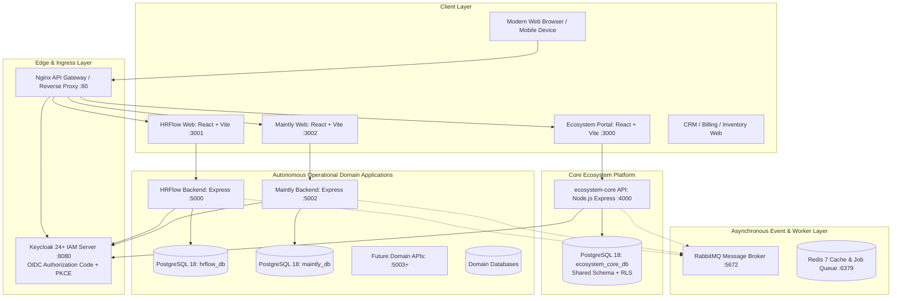

# Ecosystem Core Architecture & System Design

## 1. Vision & Architectural Principles

The Automobile Dealership Ecosystem is an enterprise-grade, multi-tenant B2B SaaS platform engineered for multi-brand, multi-firm automobile dealership networks across India.

### Architectural Principles:
1. **Separation of Concerns & Operational Autonomy**: Operational domains (HR & Payroll, Maintenance & Facilities, Enquiry CRM, Vehicle Sales & Inventory) maintain their own operational databases and domain logic. No operational application directly reads from or writes to another operational application's database.
2. **Centralized Identity & Governance**: All legal firms, brands, physical branches, departments, central user accounts, application subscriptions, and scoped permissions are governed centrally in `ecosystem-core`.
3. **No Unnecessary Rebuilding**: Existing applications (`HRFlow`, `MAINTLY`) are integrated cleanly via standardized contracts, Single Sign-On (SSO), and event-driven data synchronization without destructive refactoring.
4. **Strict Multi-Tenant Isolation**: Every tenant-owned record in every database possesses a strict tenant identifier. Zero cross-tenant data leakage is guaranteed at the database, ORM, middleware, and API gateway layers.
5. **Pure JavaScript Modern Stack**: React 18, Vite, Tailwind CSS, Node.js, Express, PostgreSQL 18, Prisma ORM, Keycloak OIDC, Docker Compose, Nginx, RabbitMQ. Zero TypeScript or MongoDB overhead.

---

## 2. High-Level System Architecture



---

## 2.1 Phase 5 HRFlow Integration Architecture

In Phase 5, **HRFlow HRMS & Payroll** was integrated with the central ecosystem under the following architectural boundaries:
1. **Dual Independent Databases**:
   - `ecosystem_core_db` (Port 5433): Authoritative repository for Dealership Tenants, Legal Entities (Firms), OEM Brands, Physical Dealership Branches, Departments, Central User directory, and Scoped RBAC permissions.
   - `hrflow_db` (Port 5433): Authoritative operational database for Employee Master profiles, 10-tab dossiers, designations, Indian payroll runs, salary advance ledgers, biometrics attendance, joining formalities, and recruitment vacancies.
2. **Central SSO & In-Memory Token Safety**:
   - Frontends (`ecosystem-portal` :3000 and `hrflow-web` :3001) authenticate through Central Keycloak (:8080) via OIDC Authorization Code Flow with PKCE (RFC 7636 S256).
   - Single Sign-On session is shared across browser contexts via `KEYCLOAK_SESSION` cookie; users logged into the Portal open HRFlow without re-authenticating.
   - Zero storage of access tokens in `localStorage` or `sessionStorage`. All tokens reside strictly in React state memory.
3. **Decoupled Backend Verification**:
   - HRFlow Backend (:5000) independently verifies Keycloak RS256 access tokens against Keycloak JWKS (`/protocol/openid-connect/certs`).
   - Non-destructive canonical mapping links local HRFlow entities to central identifiers (`centralTenantId`, `centralBranchId`, `centralUserId`).
4. **Autonomous Operational Lifecycle**:
   - HRFlow remains an independently runnable and deployable application with full backward compatibility for local test harnesses.

---

## 3. Technology Stack & Decision Rationale

| Technology | Selection | Strategic Rationale |
|---|---|---|
| **Frontend** | React 18, Vite, Tailwind CSS, JavaScript (`.jsx`) | Blazing fast build times, lightweight bundle size, rich enterprise dashboard aesthetics, zero TypeScript compilation delays. |
| **Backend** | Node.js (v20+), Express.js (v4.21+), JavaScript (`.js`) | Asynchronous non-blocking I/O, vast ecosystem of stable enterprise packages, rapid feature velocity. |
| **Database** | PostgreSQL 18 | World-class relational consistency, JSONB support for dynamic settings, composite primary/foreign keys, Row-Level Security (RLS), high-throughput indexing. |
| **ORM** | Prisma 5.22+ | Type-safe schema generation, automatic migration tracking, unified query syntax across pure JavaScript backends. |
| **Authentication** | Keycloak with OpenID Connect (OIDC) & PKCE | Enterprise SSO, standard RS256 token signing, user federation, multi-realm and multi-client architecture, central account suspension. |
| **API Gateway** | Nginx | High-performance reverse proxy, unified ingress (port 80/443), path-based routing, SSL termination, and rate-limiting. |
| **Local DevOps** | Docker Compose | Reproducible local development of PostgreSQL 18, Keycloak, Redis, RabbitMQ, and micro-applications. |
| **Async Messaging** | RabbitMQ + BullMQ/Redis | Transactional outbox event publishing, at-least-once delivery, dead-letter queues, idempotent consumers for inter-app sync. |

---

## 4. Multi-Tenant Isolation Architecture

The ecosystem implements **Shared Database, Shared Schema with Logical Multi-Tenancy** for `ecosystem-core`:

```
┌────────────────────────────────────────────────────────┐
│               PostgreSQL: ecosystem_core_db            │
│  ┌──────────────────────────────────────────────────┐  │
│  │ Table: users, firms, brands, branches            │  │
│  │  Columns: [tenant_id, id, name, ..., created_at] │  │
│  └──────────────────────────────────────────────────┘  │
│                           ▲                            │
│                           │ Database Enforcement       │
│  ┌──────────────────────────────────────────────────┐  │
│  │ Row-Level Security (RLS) Policy:                 │  │
│  │   USING (tenant_id = current_setting('app.tid')) │  │
│  └──────────────────────────────────────────────────┘  │
└────────────────────────────────────────────────────────┘
```

1. **Every Tenant-Owned Table has `tenantId`**:
   - Foreign key to `tenants(id)` on delete cascade/restrict.
   - Composite unique constraints: `@@unique([tenantId, code])`, `@@unique([tenantId, email])`.
   - Dedicated indexes on `[tenantId]` for all lookup paths.
2. **Context Injection in Express Middleware**:
   - Every incoming HTTP request passes through `authMiddleware` which extracts verified `tenantId` from the OIDC JWT token.
   - The verified `tenantId` is stamped onto `req.tenantId` and injected into database transactions.
3. **Database-Level Row-Level Security (RLS)**:
   - PostgreSQL RLS policies can be activated on tenant-scoped tables ensuring that even in the event of an application query bug, records from other tenants cannot be read or modified.
4. **Cross-Tenant Telemetry for Platform Admins**:
   - Users with the global `PLATFORM_ADMIN` role bypass tenant scoping strictly for cross-tenant billing, provisioning, and health monitoring.

---

## 5. Central Ecosystem Responsibilities (`ecosystem-core`)

`ecosystem-core` is the brain and governance hub of the dealership network:
1. **Tenant Onboarding & Lifecycle**: Create dealership groups, toggle active/suspended states, manage subscription plans and billing cycles.
2. **Organizational Master Data**:
   - Legal entities/firms (`Firm`).
   - Automobile OEM franchises (`Brand`).
   - Franchise-holding associations (`FirmBrand`).
   - Physical showroom/workshop outlets (`Branch`).
   - Functional business units (`Department`).
3. **Central Identity & Directory**:
   - Central users with single credentials across all applications.
   - Multi-tenant memberships (`OrganizationMembership`) linking users to multiple firms, branches, and departments.
4. **Application Registry & Subscriptions**:
   - Catalog of registered ecosystem applications (HRFlow, MAINTLY, Enquiry CRM, etc.).
   - Tenant-level subscriptions: activate/deactivate applications per tenant and configure feature entitlements.
5. **Scoped RBAC Engine**:
   - Role templates and custom tenant roles.
   - Granular permissions (`<domain>.<entity>.<action>`).
   - Scoped role assignments with firm, brand, branch, and department scope.
6. **Integration Outbox & Event Distribution**:
   - Transactional outbox publishing domain events (`tenant.created`, `user.created`, `branch.updated`).
7. **Immutable Audit Trails**:
   - Audit logging for all administrative operations, membership changes, and permission grants.

---

## 6. Zero-Downtime Deployment & Continuous Evolution

- **Autonomous Repositories / Directories**: Each application (`ecosystem-core`, `HRFlow`, `MAINTLY`) maintains its own `package.json`, server entry point, Prisma schema, and test suite.
- **Contract-First APIs**: Cross-application interactions utilize versioned HTTP endpoints (`/api/v1/...`) and versioned event payloads (`v1.employee.created`).
- **Independent Deployability**: Updating HRFlow (e.g. updating Indian payroll tax brackets) requires zero downtime or redeployment of MAINTLY or Ecosystem Core.

---

## 7. MAINTLY Integration Architecture (Phase 6)

```
+-----------------------------------------------------------------------------------------+
|                                    CENTRAL ECOSYSTEM                                    |
|                                                                                         |
|  +------------------------+      +------------------------+      +-------------------+  |
|  | Ecosystem Portal (3000)| <--> |   Keycloak IAM (8080)  | <--> | Core API (4000)   |  |
|  | React 19 + Tailwind    |      |   OIDC + PKCE (RS256)  |      | Express + Prisma  |  |
|  +-----------+------------+      +-----------+------------+      +---------+---------+  |
|              |                               |                             |            |
+--------------|-------------------------------|-----------------------------|------------+
               | App Launch                    | SSO Auth Code / JWKS        | S2S Identity
               v                               v                             v
+-----------------------------------------------------------------------------------------+
|                                  MAINTLY APPLICATION                                    |
|                                                                                         |
|  +------------------------+      +------------------------+      +-------------------+  |
|  |  MAINTLY Web (3002)    | ---> | MAINTLY Backend (5002) | ---> | maintly_db (5433) |  |
|  |  React 18 + Vite       |      | Independent RS256 Verif|      | PostgreSQL 18     |  |
|  +------------------------+      +-----------+------------+      +-------------------+  |
|                                              |                                          |
|                                              v EmployeeReference Cache                  |
|                                  +------------------------+                             |
|                                  |   HRFlow API (5000)    |                             |
|                                  |   /v1/integrations/emp |                             |
|                                  +------------------------+                             |
+-----------------------------------------------------------------------------------------+
```

1. **Topology & Isolation**:
   - `maintly_db` remains completely distinct from `ecosystem_core_db` and `hrflow_db` on PostgreSQL 18 (port 5433).
   - Backend operates on port `5002`, frontend operates on port `3002`.
2. **Central SSO & Independent JWT Verification**:
   - `maintly-web` client on Keycloak using Authorization Code Flow with PKCE (S256).
   - In-memory token storage (zero token leakage via URLs or localStorage).
   - Backend independently fetches Keycloak JWKS (`:8080/realms/automobile-ecosystem/protocol/openid-connect/certs`) and validates RS256 signature, issuer, audience (`maintly-api`), and expiration.
3. **Additive Organizational Mapping**:
   - Additive columns on existing models: `centralTenantId`, `centralFirmId`, `centralBrandId`, `centralBranchId`, `centralDepartmentId`, `centralUserId` with indexes. Zero historical data modified.
4. **EmployeeReference Architecture (Phase 6 Foundation)**:
   - Dedicated local cache model `EmployeeReference` capturing HR employee IDs, employee codes, central tenant and branch bindings. Prepared for Phase 7 bidirectional synchronization.

---

## 8. HRFlow to MAINTLY Employee Synchronization Architecture (Phase 7)

```
+---------------------------------------------------------------------------------------------------------------+
|                                            HRFlow Backend (Port 5000)                                         |
|                                                                                                               |
|  +--------------------+   Same Transaction    +-------------------+                                           |
|  | Employee Mutation  | -------------------> | OutboxEvent Table |                                           |
|  | (Create/Update/Tx) |                       | (PENDING)         |                                           |
|  +--------------------+                       +---------+---------+                                           |
|                                                         |                                                     |
|                                                         v Background Poller (every 2s)                        |
|                                               +-------------------+                                           |
|                                               |  OutboxPublisher  | (Exponential Backoff up to 60s)           |
|                                               +---------+---------+                                           |
+---------------------------------------------------------|-----------------------------------------------------+
                                                          | AMQP / REST Fallback
                                                          v
+---------------------------------------------------------------------------------------------------------------+
|                                      RabbitMQ Message Broker (Port 5672/15672)                                |
|                                                                                                               |
|          Topic Exchange: automobile.events.topic (Routing Key: employee.<action>)                             |
|                                       |                                                                       |
|                     +-----------------+-----------------+                                                     |
|                     | Binding: employee.#               | Dead-Letter Exchange (DLX)                          |
|                     v                                   v                                                     |
|          Queue: maintly.employee.sync        Queue: maintly.employee.sync.dlq                                 |
+---------------------------------------------------------|-----------------------------------------------------+
                                                          | AMQP Consumer / SSE / Long-poll
                                                          v
+---------------------------------------------------------------------------------------------------------------+
|                                           MAINTLY Backend (Port 5002)                                         |
|                                                                                                               |
|  +---------------------+   Check Idempotency    +-------------------+   Tenant Boundary   +-----------------+ |
|  |    EventConsumer    | ---------------------> |  ProcessedEvent   | ------------------> |EmployeeReference| |
|  | (Queue Subscription)|   (Reject Duplicates)  | (eventId Unique)  |   (Reject Unknown)  |  (maintly_db)   | |
|  +---------------------+                        +-------------------+                     +-----------------+ |
+---------------------------------------------------------------------------------------------------------------+
```

### Architectural Guarantees:
1. **Transactional Outbox Pattern (Zero Message Loss)**:
   - All employee lifecycle operations (`employee.created`, `employee.updated`, `employee.transferred`, `employee.deactivated`, `employee.reactivated`) are written to `OutboxEvent` within the exact same database transaction (`prisma.$transaction`) as the employee mutation.
   - If the database write rolls back, no event is ever published. If the broker is offline, the event remains safely stored in `OutboxEvent` with status `PENDING`.
2. **Reliable Asynchronous Delivery & Dead-Letter Handling**:
   - `OutboxPublisher` processes pending events with exponential backoff (`Math.min(60000, 1000 * 2^retries)`).
   - Poison messages failing consumer processing repeatedly are routed to `maintly.employee.sync.dlq` via the Dead-Letter Exchange.
   - Administrators can replay DLQ events directly from the Ecosystem Portal or via REST API (`POST /api/v1/sync/replay-dlq`).
3. **Strict Idempotency & Safe Event Replay**:
   - MAINTLY tracks every processed event ID in `ProcessedEvent` with a unique index.
   - Replaying an event (whether due to network retries, DLQ replay, or manual retry) is completely idempotent: MAINTLY acknowledges the message without generating duplicate `EmployeeReference` records.
4. **Tenant Isolation & Security Boundaries**:
   - Every event payload includes `centralTenantId` and `centralBranchId`.
   - Incoming events are verified against MAINTLY's active tenant directory. Cross-tenant events or events referencing foreign tenants are rejected with zero database mutation.
   - Sensitive HR information (salary, bank accounts, PAN, Aadhaar, KYC documents) is strictly excluded from event payloads and initial synchronization APIs.
5. **Historical Integrity & Maintenance Preservation**:
   - Employee deactivation sets `EmployeeReference.status = 'INACTIVE'`. Records are never deleted, ensuring historical maintenance tickets, equipment logs, and purchase requisitions remain fully linked and auditable.


