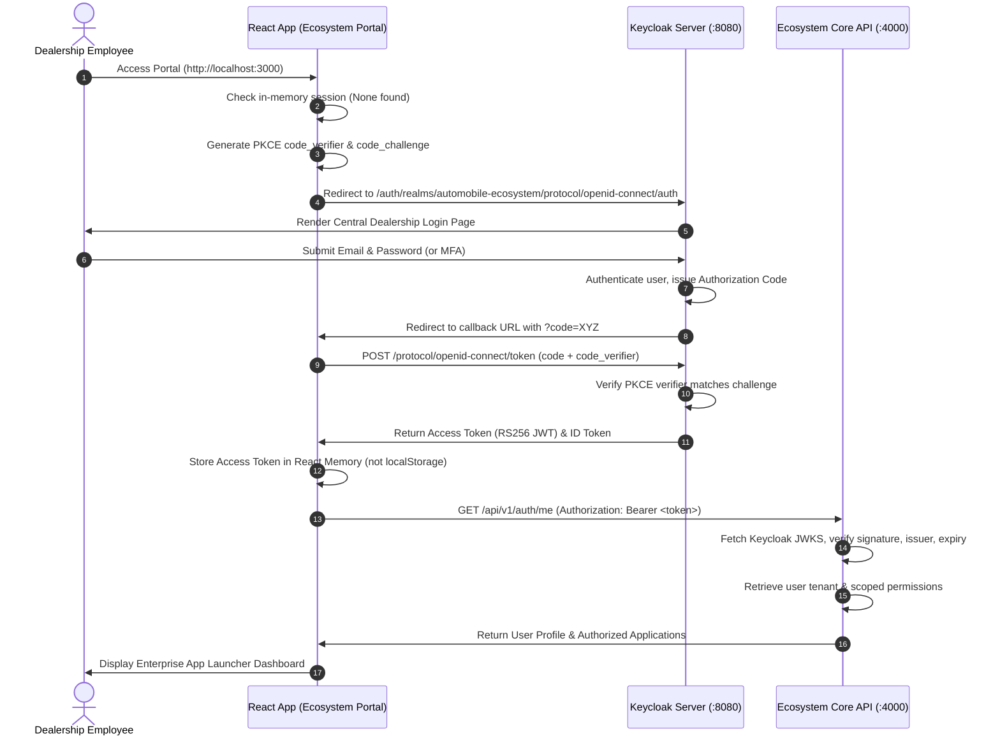

# Central Authentication & Single Sign-On (SSO) Architecture

## 1. Identity Architecture Overview

The Automobile Dealership Ecosystem relies on **Keycloak (v24+)** as the centralized Identity Provider (IdP) implementing the **OpenID Connect (OIDC) Core 1.0** and **OAuth 2.0 Authorization Framework**.

### Core Objectives:
1. **True Single Sign-On (SSO)**: Dealership employees log in once at the Ecosystem Portal and navigate between HRMS, Maintenance, CRM, and Inventory without re-entering credentials.
2. **Standard Cryptographic Trust**: All micro-applications and backend APIs validate stateless JSON Web Tokens (JWT) signed via **RS256 (RSA Signature with SHA-256)** against Keycloak's public JSON Web Key Set (JWKS).
3. **No Access Tokens in `localStorage`**: Avoid XSS token theft vulnerabilities by storing tokens in memory with secure refresh token rotation and HttpOnly cookies.
4. **Independent Backend Token Verification**: Every backend (`ecosystem-core`, `HRFlow`, `MAINTLY`) independently validates token signature, issuer, audience, expiry, and tenant claims.
5. **Development & CI/CD Resilience**: A built-in Development Auth Bridge / Mock OIDC provider ensures that automated test suites and standalone local developers can test immediately without requiring a running Docker Keycloak instance.

---

## 2. Keycloak Realm & Client Topology

```
┌────────────────────────────────────────────────────────────────────────┐
│                        KEYCLOAK IDENTITY REALM                         │
│                    Realm: 'automobile-ecosystem'                       │
├────────────────────────────────────────────────────────────────────────┤
│                                                                        │
│   PUBLIC CLIENTS (Authorization Code Flow with PKCE):                  │
│   ├─ ecosystem-portal  (Origin: http://localhost:3000)                │
│   ├─ hrflow-web        (Origin: http://localhost:3001)                │
│   └─ maintly-web       (Origin: http://localhost:3002)                │
│                                                                        │
│   BEARER-ONLY RESOURCE SERVERS (Validates RS256 Access Tokens):        │
│   ├─ ecosystem-core-api (Audience: ecosystem-core-api, Port: 4000)     │
│   ├─ hrflow-api         (Audience: hrflow-api, Port: 5000)             │
│   └─ maintly-api        (Audience: maintly-api, Port: 5002)            │
│                                                                        │
│   SERVICE ACCOUNTS (Client Credentials Flow for Inter-Service Auth):   │
│   └─ inter-service-client (Internal API-to-API communication)          │
│                                                                        │
└────────────────────────────────────────────────────────────────────────┘
```

---

## 3. OIDC Authorization Code Flow with PKCE



---

## 4. JWT Claims Specification

The Keycloak Access Token is augmented with custom mappers injecting the user's canonical dealership context:

```json
{
  "iss": "http://localhost:8080/realms/automobile-ecosystem",
  "sub": "a1b2c3d4-e5f6-7a8b-9c0d-1e2f3a4b5c6d",
  "aud": ["account", "ecosystem-core-api", "hrflow-api", "maintly-api"],
  "exp": 1790250000,
  "nbf": 1790246400,
  "iat": 1790246400,
  "jti": "8f8b340a-f027-4c45-8f4b-2d7c04113fa4",
  "typ": "Bearer",
  "email": "bm.hubli@belladgroup.com",
  "email_verified": true,
  "name": "Rajesh Sharma",
  "preferred_username": "rajesh.sharma",
  "given_name": "Rajesh",
  "family_name": "Sharma",
  "tenant_id": "tenant-bellad-group-uuid",
  "tenant_code": "BELLAD",
  "is_platform_admin": false,
  "memberships": [
    {
      "firm_id": "firm-bellad-motors-uuid",
      "firm_code": "BMPL",
      "branch_id": "branch-hubli-uuid",
      "branch_code": "HBL-SHOWROOM-01",
      "department_code": "SERVICE",
      "is_primary": true
    }
  ],
  "roles": ["BRANCH_MANAGER"],
  "permissions": [
    "hr.employee.read",
    "hr.leave.approve",
    "hr.attendance.correct",
    "maintenance.ticket.create",
    "maintenance.ticket.approve",
    "maintenance.ticket.assign"
  ]
}
```

---

## 5. Backend Token Verification Middleware

Every Express backend executes standard cryptographic verification:

```javascript
import jwt from 'jsonwebtoken';
import jwksClient from 'jwks-rsa';

const client = jwksClient({
  jwksUri: process.env.KEYCLOAK_JWKS_URI || 'http://localhost:8080/realms/automobile-ecosystem/protocol/openid-connect/certs',
  cache: true,
  cacheMaxEntries: 10,
  rateLimit: true,
  jwksRequestsPerMinute: 10
});

function getKey(header, callback) {
  client.getSigningKey(header.kid, (err, key) => {
    if (err) return callback(err, null);
    const signingKey = key.publicKey || key.rsaPublicKey;
    callback(null, signingKey);
  });
}

export async function verifyKeycloakToken(req, res, next) {
  const authHeader = req.headers.authorization;
  if (!authHeader || !authHeader.startsWith('Bearer ')) {
    return res.status(401).json({ success: false, message: 'Authorization Bearer token required.' });
  }

  const token = authHeader.split(' ')[1];

  jwt.verify(
    token,
    getKey,
    {
      issuer: process.env.KEYCLOAK_ISSUER || 'http://localhost:8080/realms/automobile-ecosystem',
      algorithms: ['RS256']
    },
    (err, decoded) => {
      if (err) {
        // In local development or testing, fall back to legacy HMAC verification
        if (process.env.NODE_ENV !== 'production') {
          return verifyLegacyFallbackToken(token, req, res, next);
        }
        return res.status(401).json({ success: false, message: 'Invalid or expired OIDC access token.' });
      }

      req.user = decoded;
      req.userId = decoded.sub;
      req.tenantId = decoded.tenant_id;
      req.isPlatformAdmin = decoded.is_platform_admin === true;
      req.permissions = decoded.permissions || [];

      next();
    }
  );
}
```

---

## 6. Secure Token Storage Strategy in React Frontends

### Why Avoid `localStorage`?
Storing access tokens in `localStorage` exposes them to any cross-site scripting (XSS) vulnerability or malicious third-party npm package in the bundle.

### Production Storage Pattern:
1. **Access Token in Memory**: Stored in React state/Context (`AuthContext`). If the user refreshes the page, the client silently queries the `/refresh` endpoint via an HttpOnly cookie.
2. **Refresh Token in HttpOnly, Secure, SameSite Cookie**: The refresh token is never exposed to JavaScript code. It is handled exclusively by the browser's native cookie jar sent to `/api/v1/auth/refresh`.
3. **Automatic Silent Token Refresh**: An Axios response interceptor intercepts HTTP 401, requests a fresh access token using the HttpOnly cookie, and transparently retries the failed request.

---

## 7. Dual-Mode Development & Test Auth Bridge

To satisfy the critical constraint that automated test suites (`npm run test` in HRFlow and MAINTLY) must run effortlessly without needing a heavy Keycloak server running on every dev machine, `ecosystem-core` and the integrated backends provide a **Dual-Mode Auth Verifier**:
1. When Keycloak is active and an RS256 token is provided, full cryptographic validation is enforced.
2. When testing locally or executing unit tests, standard HMAC tokens signed with `JWT_SECRET` are accepted and mapped to the same unified user context (`req.user`, `req.tenantId`, `req.permissions`).

---

## 8. Phase 5: HRFlow Central SSO & RBAC Integration Specifications

### 8.1 Keycloak PKCE Integration in HRFlow Frontend
- **Client ID**: `hrflow-web`
- **Redirect URI**: `http://localhost:3001/callback`
- **Protocol**: OIDC Authorization Code Flow with PKCE (`S256` code challenge method).
- **Session Sharing**: HRFlow leverages the `KEYCLOAK_SESSION` HttpOnly cookie set by Keycloak on `:8080`. When a user launches HRFlow from the Ecosystem Portal, `AuthContext` requests `/protocol/openid-connect/auth`. Because an active Keycloak session is present, Keycloak immediately responds with an HTTP 302 redirect carrying an authorization code. No credentials prompt is displayed to the user.

### 8.2 Strict In-Memory Access Token Storage
In accordance with enterprise SaaS security standards:
- All references to `localStorage.setItem('hrflow_token', ...)` were removed.
- Tokens are stored exclusively in React memory closure inside `AuthContext.jsx` and `api.js`.
- If a session expires or an unauthorized 401/403 occurs, memory is wiped and the user is redirected to Central Keycloak.

### 8.3 Backend Cryptographic RS256 Token Verification (`HRFlow/backend/src/middleware/auth.js`)
- Backend utilizes `jwks-rsa` to fetch public signing keys from `http://localhost:8080/realms/automobile-ecosystem/protocol/openid-connect/certs`.
- Verifies token issuer (`http://localhost:8080/realms/automobile-ecosystem`).
- Validates audience (`aud` contains `hrflow-api`, `ecosystem-core-api`, or `hrflow-web`).
- Checks user suspension: queries `prisma.user` or validates token status claim. Suspended accounts are immediately rejected with HTTP 401/403.
- JIT User Linking: Maps Keycloak user claims (`sub`, `email`) to local `prisma.user` records with `centralUserId` and `centralTenantId`.

### 8.4 Scoped RBAC Permissions
HRFlow routes enforce central permissions mapped from token claims:
- `hr.employee.read`: View Employee Master dossiers and organizational directory.
- `hr.employee.create`: Onboard new employees and invite candidates.
- `hr.employee.update`: Update employee records, designations, and branch transfers.
- `hr.employee.delete`: Terminate or soft-delete employee profiles.
- `hr.attendance.manage`: View, punch, and correct biometric attendance records.
- `hr.leave.approve`: Approve or reject employee leave requisitions.
- `hr.payroll.manage`: Calculate monthly Indian payroll, process deductions, and generate payment advices.
- `hr.recruitment.manage`: Create job vacancies and manpower budgeting.

---

## 9. Phase 6: MAINTLY Central SSO & RBAC Integration Specifications

### 9.1 Keycloak PKCE Integration in MAINTLY Frontend
- **Client ID**: `maintly-web`
- **Redirect URI**: `http://localhost:3002/callback`
- **Protocol**: OIDC Authorization Code Flow with PKCE (`S256` code challenge method).
- **Session Sharing**: MAINTLY utilizes the `KEYCLOAK_SESSION` HttpOnly cookie set by Keycloak on `:8080`. When a user launches MAINTLY from the Portal (`:3000/apps`), `AuthContext` requests `/protocol/openid-connect/auth`. The existing Keycloak session enables silent SSO: Keycloak issues an HTTP 302 redirect with an authorization code with zero user friction.
- **In-Memory Token Handling**: All `localStorage.setItem('maintly_token', ...)` references were eradicated. Tokens are held purely in memory closure in `api.js` and `AuthContext.jsx`.

### 9.2 Independent Backend Cryptographic Verification (`Maintly/backend/src/middleware/auth.js`)
- **JWKS Fetching**: Connects to `http://localhost:8080/realms/automobile-ecosystem/protocol/openid-connect/certs` via `jwks-rsa`.
- **Validation**: Independent RS256 signature verification, checks `iss` (`http://localhost:8080/realms/automobile-ecosystem`), and ensures `aud` includes `maintly-api` or `maintly-web`.
- **Suspension Enforcement**: Suspended users (`user.status === 'SUSPENDED'`) are blocked on every protected API call with HTTP 401/403.
- **JIT User Provisioning & Linking**: Resolves central user by `centralUserId` or `email`, populates `centralUserId` and `centralTenantId` dynamically.
- **Branch Scope Mapping**: Maps memberships into `req.branchIds`, powering fine-grained branch access control.

### 9.3 Scoped RBAC Permissions for Maintenance
- `maintenance.ticket.create`: Raise breakdown/preventive maintenance tickets.
- `maintenance.ticket.read`: View branch and departmental maintenance logs.
- `maintenance.ticket.assign`: Assign internal technicians or external OEM vendors.
- `maintenance.ticket.approve`: Sign off on ticket completions, cost estimates, and high-value repairs.
- `maintenance.ticket.execute`: Log labor, work progress, timeline milestones, and parts consumed.
- `maintenance.purchase.request`: Create purchase requisitions linked to maintenance tickets.

