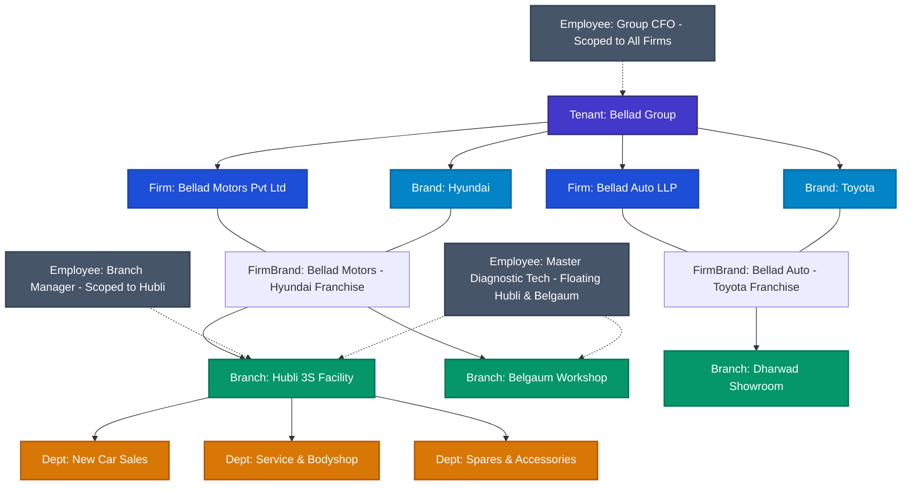

# Automobile Dealership Organizational Hierarchy & Modeling

## 1. Domain Context: Indian Automobile Dealership Groups

Automobile dealership networks in India operate under unique legal, operational, and commercial constraints that cannot be accommodated by naive corporate hierarchies. 

### Key Real-World Dealership Dynamics:
1. **Multi-Firm Legal Structure**: An automobile dealership group (e.g., *Bellad Group*, *Apex Automotive Group*, *Popular Vehicles & Services*) rarely operates under a single legal entity. OEMs (such as Hyundai, Maruti Suzuki, Toyota, Kia, Tata Motors) legally require separate corporate entities or balance sheets for each franchise agreement (e.g., *Bellad Motors Pvt Ltd* for Hyundai, *Bellad Auto LLP* for Toyota).
2. **Shared Group Leadership**: Top management (Managing Director, CEO, CFO, Group HR Head, Group IT Head) govern all legal firms and brands across the group.
3. **Cross-Brand & Multi-Branch Operations**: 
   - A Bodyshop facility might service multiple brands under the same group.
   - Senior technicians, diagnostic specialists, and insurance officers frequently float between branches.
   - Branch Managers may oversee both a showroom and a separate workshop location.
4. **Physical Outlets vs. Functional Departments**: A single physical location (Branch) hosts multiple functional teams (New Car Sales, Used Cars / Trade-in, Mechanical Service, Bodyshop, Spare Parts, Accounts & Finance, Customer Relations).

---

## 2. Canonical 6-Tier Organizational Model

---

## 3. Structural Entity Definitions

| Tier | Entity | Cardinality | Real-World Automotive Representation |
|---|---|---|---|
| **Tier 1** | **Tenant** | 1 per group | The overarching Dealership Conglomerate (e.g. *Bellad Group*). Top-level SaaS billing and isolation root. |
| **Tier 2** | **Firm** | 1..N per Tenant | Legal corporate entity with specific PAN, GSTIN, CIN registered with Registrar of Companies (e.g. *Bellad Motors Pvt Ltd*). |
| **Tier 3** | **Brand** | 1..N per Tenant | Automotive Manufacturer / OEM (e.g. *Hyundai Motor India*, *Maruti Suzuki India Ltd*). |
| **Tier 3b** | **FirmBrand** | Junction | Specific dealer franchise agreement binding a legal firm to an OEM brand. |
| **Tier 4** | **Branch** | 1..N per Firm | Physical facility (Showroom, Workshop, 3S facility, Stockyard, PDI Center) with unique physical address and local branch code. |
| **Tier 5** | **Department** | 1..N per Branch | Functional operational team: *Sales*, *Service*, *Bodyshop*, *Parts*, *Customer Care*, *Finance*. |
| **Tier 6** | **Membership** | N..M per User | Multi-point assignment linking employees to primary and secondary branches and departments. |

---

## 4. Multi-Assignment & Floating Staff Capabilities

Traditional HR or ERP systems force each user into a single branch. In automotive networks, that assumption fails immediately:

### Scenario A: Group Leadership (Cross-Firm, Cross-Brand)
- **Role**: `GROUP_CFO` or `MANAGING_DIRECTOR`
- **Scope**: `ScopeType.TENANT`
- **Effect**: Full visibility across all legal entities, balance sheets, branch P&Ls, and headcount telemetry.

### Scenario B: Brand Head
- **Role**: `BRAND_GENERAL_MANAGER`
- **Scope**: `ScopeType.BRAND` (e.g., Hyundai Brand Head)
- **Effect**: Oversees all Hyundai branches (Hubli, Belgaum, Dharwad) under the group, but cannot inspect Toyota or Kia sales pipelines.

### Scenario C: Branch Manager
- **Role**: `BRANCH_MANAGER`
- **Scope**: `ScopeType.BRANCH` (e.g., Hubli 3S Facility)
- **Effect**: Approves leave requests, attendance punch corrections, SIM/laptop requisitions, and maintenance tasks within the Hubli facility.

### Scenario D: Floating Specialist Technician
- **Role**: `TECHNICIAN`
- **Assignments**: Primary: *Hubli Workshop*; Secondary: *Belgaum Workshop*.
- **Effect**: Can be assigned maintenance tickets or repair work orders at either facility.

---

## 5. Transition Mapping from Existing HRFlow & MAINTLY

### HRFlow Mapping
- **Current**: Has `Tenant` and `Branch`. `department` is a string field on `Employee`.
- **Ecosystem Integration**:
  1. HRFlow `Tenant` maps directly to central `Tenant`.
  2. HRFlow `Branch` records are mapped to central `Branch` instances (linked to the primary default `Firm`).
  3. String `department` values ("Sales", "Service", "Accounts") are normalized to canonical `Department` records.
  4. HRFlow `Employee` records gain a foreign reference `centralUserId` linking to central `User`.

### MAINTLY Mapping
- **Current**: Has `Tenant`, `Brand`, `Branch`, `Department`, `BranchDepartment`, `BranchArea`, and `UserBranchAccess`.
- **Ecosystem Integration**:
  1. MAINTLY `Tenant`, `Brand`, `Branch`, and `Department` synchronize with central master entities.
  2. `Firm` is introduced above `Brand` to capture legal franchise ownership.
  3. `UserBranchAccess` aligns seamlessly with `OrganizationMembership`.
  4. MAINTLY maintenance requests continue to reference branch and department, while referencing employees via the central user directory and HR employee sync.
