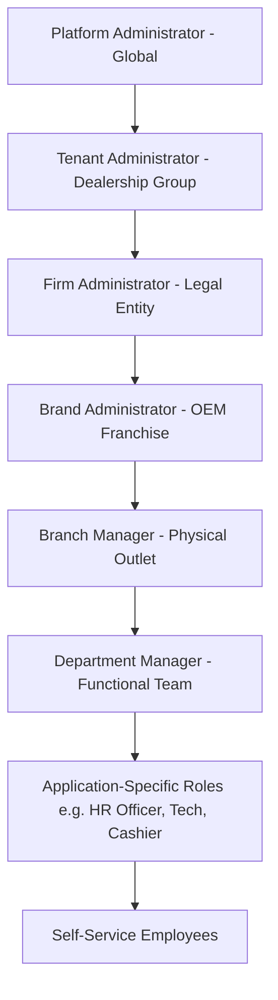

# Scoped Role-Based Access Control (RBAC) Engine

## 1. Architectural Philosophy

Enterprise automotive groups cannot function on rigid, flat role systems (such as generic "Admin" or "User"). A Branch Manager in Hubli must not approve invoices in Belgaum; a Brand Head for Hyundai must not inspect Toyota sales pipelines; a Technician may have supervisor privileges in the electrical bay but regular technician privileges in mechanical maintenance.

The Ecosystem Core RBAC Engine implements **Permission-Based Access Control with Scoped Organizational Dimensions**.

---

## 2. Core Concepts: Roles, Permissions, and Scopes

### 2.1 Granular Permissions Format
Permissions follow a standardized, domain-driven dot notation:
```text
<domain>.<resource>.<action>
```
Examples:
- `hr.employee.read`
- `hr.employee.create`
- `hr.employee.update`
- `hr.leave.approve`
- `hr.payroll.process`
- `maintenance.ticket.create`
- `maintenance.ticket.assign`
- `maintenance.ticket.approve`
- `maintenance.asset.manage`
- `platform.tenant.manage`
- `platform.application.register`
- `org.firm.manage`
- `org.branch.manage`
- `enquiry.lead.create`
- `enquiry.lead.assign`

### 2.2 Scopes
A user does not merely hold a role; they hold a role **at an organizational scope**:

| Scope Type | Scope Target Field | Description | Example |
|---|---|---|---|
| `GLOBAL` | `null` | Cross-tenant platform administration | Platform Super Admin |
| `TENANT` | `tenantId` | Entire Dealership Group | Group CEO, Group HR Head |
| `FIRM` | `firmId` | Specific Legal Entity | Legal Firm Managing Director |
| `BRAND` | `brandId` | Specific OEM Franchise | Brand Head (e.g. Hyundai Operations) |
| `BRANCH` | `branchId` | Specific Facility / Showroom / Workshop | Branch General Manager, Service Manager |
| `DEPARTMENT` | `departmentId` | Specific Team within a facility | Bodyshop Supervisor, Sales Team Lead |

---

## 3. Organizational Role Examples



*Note: This hierarchy illustrates scope inheritance; custom roles and arbitrary permission sets can be configured by tenant administrators.*

---

## 4. Comprehensive Permissions Catalog

### Platform & Governance Domain (`platform.*`, `org.*`)
| Permission Code | Description | Default Roles |
|---|---|---|
| `platform.tenant.manage` | Onboard, configure, suspend dealership tenants | `PLATFORM_ADMIN` |
| `platform.application.manage` | Register ecosystem apps and define capabilities | `PLATFORM_ADMIN` |
| `platform.telemetry.view` | View global health, error rates, and system logs | `PLATFORM_ADMIN` |
| `org.tenant.update` | Modify dealership group profile and settings | `TENANT_ADMIN` |
| `org.firm.manage` | Create and manage legal entities (PAN, GSTIN, CIN) | `TENANT_ADMIN` |
| `org.brand.manage` | Manage OEM franchises and dealer agreements | `TENANT_ADMIN`, `BRAND_HEAD` |
| `org.branch.manage` | Create, modify, and configure branch facilities | `TENANT_ADMIN`, `FIRM_ADMIN` |
| `org.department.manage`| Configure operational teams and bays | `TENANT_ADMIN`, `BRANCH_MANAGER` |
| `org.user.manage` | Provision central users and assign organizational roles | `TENANT_ADMIN`, `BRANCH_MANAGER` |
| `org.audit.view` | Inspect compliance audit logs | `TENANT_ADMIN`, `AUDITOR` |

### HRMS Domain (`hr.*`)
| Permission Code | Description | Default Roles |
|---|---|---|
| `hr.employee.read` | View employee dossiers and organizational chart | `HR_ADMIN`, `BRANCH_MANAGER`, `EMPLOYEE` (self) |
| `hr.employee.create` | Onboard new candidates and generate employee codes | `HR_ADMIN` |
| `hr.employee.update` | Edit salary structures, KYC, bank info, designations | `HR_ADMIN` |
| `hr.employee.delete` | Offboard or archive employee records | `HR_ADMIN` |
| `hr.attendance.punch` | Clock daily punch-in/out and field check-in | `EMPLOYEE` |
| `hr.attendance.correct` | Request or approve attendance punch corrections | `BRANCH_MANAGER`, `HR_ADMIN` |
| `hr.leave.apply` | Submit leave requisition | `EMPLOYEE` |
| `hr.leave.approve` | Authorize leave requests for reporting staff | `BRANCH_MANAGER`, `HR_ADMIN` |
| `hr.payroll.calculate` | Run monthly salary calculations and deductions | `HR_ADMIN`, `FINANCE_HEAD` |
| `hr.payroll.disburse` | Generate bank payment advice files | `FINANCE_HEAD` |
| `hr.asset.issue` | Assign laptops, SIM cards, ID cards | `HR_ADMIN`, `BRANCH_MANAGER` |
| `hr.exit.process` | Process resignation, clearances, and F&F settlement | `HR_ADMIN`, `BRANCH_MANAGER` |

### Maintenance & Operations Domain (`maintenance.*`)
| Permission Code | Description | Default Roles |
|---|---|---|
| `maintenance.ticket.create` | Raise repair ticket or facility request | `EMPLOYEE`, `BRANCH_MANAGER` |
| `maintenance.ticket.read` | View maintenance tickets | `ALL_AUTHENTICATED_USERS` |
| `maintenance.ticket.approve` | Authorize maintenance expenditure or work order | `APPROVER`, `BRANCH_MANAGER` |
| `maintenance.ticket.assign` | Dispatch task to internal technician or external vendor| `BRANCH_MANAGER`, `SUPERVISOR` |
| `maintenance.ticket.execute`| Update task progress, log materials, upload photos | `TECHNICIAN`, `VENDOR` |
| `maintenance.ticket.close` | Verify work completion and satisfaction | `REQUESTER`, `BRANCH_MANAGER` |
| `maintenance.purchase.request`| Create purchase requisition for parts/materials | `TECHNICIAN`, `PURCHASE_OFFICER` |
| `maintenance.purchase.order` | Issue Purchase Order to approved vendor | `PURCHASE_OFFICER` |
| `maintenance.asset.manage` | Master equipment registry, preventive maintenance SLAs | `FACILITY_HEAD`, `MAINTENANCE_ADMIN` |

---

## 5. Scope-Aware Authorization Algorithm

When an API request arrives at any backend service, authorization is evaluated with three strict questions:
1. **Tenant Check**: Does the user belong to `targetTenantId`? (Or is the user `PLATFORM_ADMIN`?) If NO → `403 Forbidden: Tenant Isolation Violation`.
2. **Permission Check**: Does the user possess permission `P` in any of their assigned roles? If NO → `403 Forbidden: Insufficient Permission`.
3. **Scope Check**: Is the permission grant scoped broadly enough to cover the requested entity?
   - `GLOBAL` → Matches any entity in the ecosystem.
   - `TENANT` → Matches any entity where `entity.tenantId == assignment.tenantId`.
   - `FIRM` → Matches when `entity.firmId == assignment.firmId`.
   - `BRAND` → Matches when `entity.brandId == assignment.brandId`.
   - `BRANCH` → Matches when `entity.branchId == assignment.branchId`.
   - `DEPARTMENT` → Matches when `entity.departmentId == assignment.departmentId`.

### Express Middleware Implementation:
```javascript
export function checkPermission(requiredPermission, getScope = (req) => ({})) {
  return async (req, res, next) => {
    if (!req.user) {
      return res.status(401).json({ success: false, message: 'Unauthenticated' });
    }

    // Platform Admins have superuser rights across tenants
    if (req.user.isPlatformAdmin) {
      return next();
    }

    const { targetFirmId, targetBrandId, targetBranchId, targetDeptId } = getScope(req);
    const assignments = req.user.userRoleAssignments || [];

    const hasAccess = assignments.some(assignment => {
      // Must match tenant
      if (assignment.tenantId !== req.tenantId) return false;

      // Must have the required permission in the assigned role
      const hasPerm = assignment.role?.rolePermissions?.some(
        rp => rp.permission?.code === requiredPermission
      );
      if (!hasPerm) return false;

      // Verify scope match
      switch (assignment.scopeType) {
        case 'TENANT':
          return true; // Grants access to all firms, branches, and departments in the tenant
        case 'FIRM':
          return !targetFirmId || assignment.firmId === targetFirmId;
        case 'BRAND':
          return !targetBrandId || assignment.brandId === targetBrandId;
        case 'BRANCH':
          return !targetBranchId || assignment.branchId === targetBranchId;
        case 'DEPARTMENT':
          return (!targetBranchId || assignment.branchId === targetBranchId) &&
                 (!targetDeptId || assignment.departmentId === targetDeptId);
        default:
          return false;
      }
    });

    if (!hasAccess) {
      return res.status(403).json({
        success: false,
        message: `Forbidden: Missing required scoped permission '${requiredPermission}'`
      });
    }

    next();
  };
}
```

---

## 6. Security Guarantees & Verification
- **Privilege Escalation Prevention**: A user cannot assign a role with permissions they do not possess.
- **Tenant Tampering Immunity**: `req.tenantId` is always decoded from the cryptographically signed JWT token; the frontend cannot forge a header or body parameter to access another tenant.
- **Automated Isolation Tests**: Test suites simulate Tenant A users requesting Tenant B resources and verify HTTP 403 / 404 rejection.
